# 코리아 IT 아카데미 정처기 3Team Project
## 1. 프로젝트 제목 - CodeTrip Japan
 - 🚗 일본 관광 및 숙소 추천 사이트 만들기
<p align="center"></p>

## 2. 프로젝트 정보
- 코리아IT아카데미 정보처리기능사 팀 프로젝트

 - 애플리케이션 주요 기능
    1. Spring Security를 이용한 로그인, 로그아웃 및 회원가입, 회원정보수정, 회원탈퇴
    2. Validation 으로 유효성 검사 체크 (중복 등)
    3. 게시판 - 문의게시판과 공지게시판을 작성하고 열람 및 댓글 작성이 가능
    4. 게시판 작성시 로그인이 필요하며 작성자 이름은 유저 정보에서 가져와서 나타냄
    5. 작성자 계정이 아닌 다른 계정으로 로그인 할 경우 수정 및 삭제 불가능
    6. 
    7. 

이름         |       역할       |       깃허브주소
---         |        ---       |         ---
여정모       | Spring Security를 이용한 로그인 기능 구현     |https://github.com/PungFackMo
손명관       | -                |
이단비       |    -             |


## 3. 프로젝트 소개
### 일본의 주요 여행지 추천 애플리케이션
    - 주요 관광지를 추천해주고 관광지 주위의 숙소를 추천해주는 애플리케이션입니다.
### 주제 선정 이유
    - 일본의 엔화 가치가 크게 떨어진 엔저 현상이 계속되고 있습니다. 엔화를 아주 싼 값에 살 수 있게 되면서 일본을 찾는 외국 관광객이 크게 늘고 있어 이번 기회에 일본 여행 애플리케이션을 기획하게 되었습니다.

## 4. 시작 가이드
### 요구 사항
- Spring Boot Starter Parent : 3.3.1
- Java Version : 17
- Node.js : 20.14.0
- npm : 10.7.0
### Installation
```
$ git clone https://github.com/PungFackMo/3TeamProject.git
$ cd 3TeamProject
```
### Backend
```
$ cd Final-3TP-Back
$ ./mvnw spring-boot:run
```
### Frontend
```
$ cd Final-3TP-Front
$ npm install
$ npm start
```

## 5. 기술 스택
### Environment


### Config


### Development


### Communication


## 6. 화면 구성
| 메인 페이지         | 로그인 페이지       |
|------------------|------------------|
| 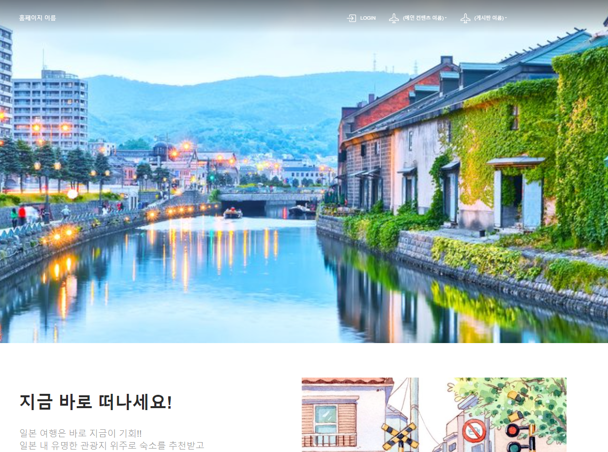 | 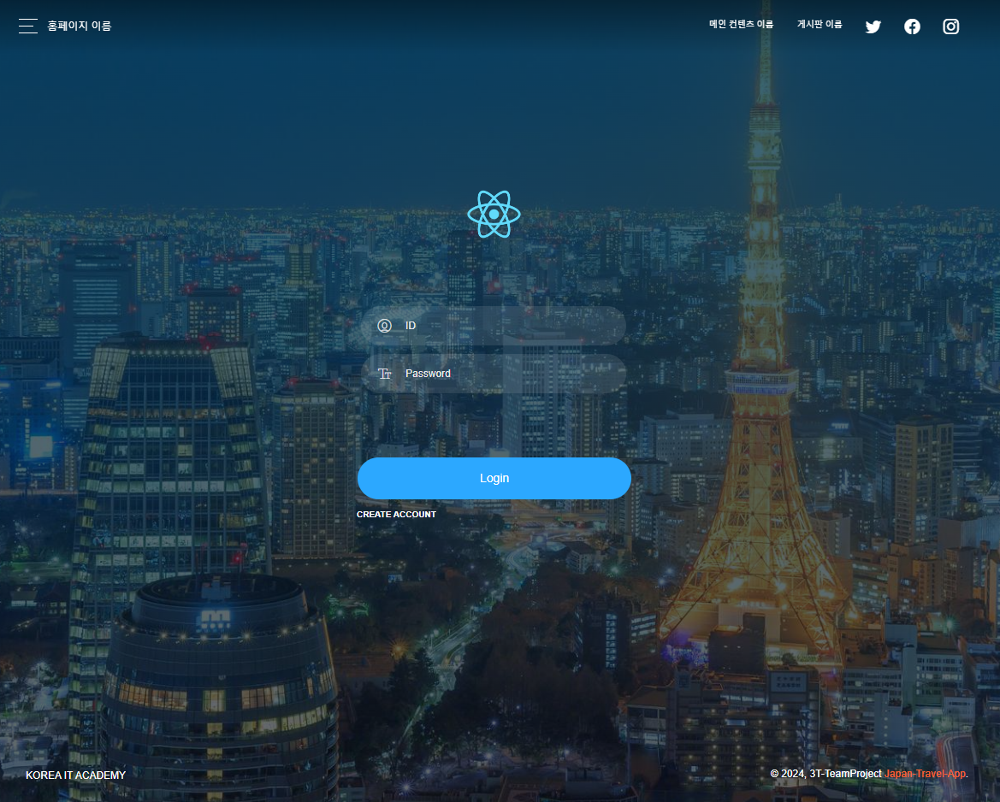 |
| 회원가입 페이지     | 회원정보 페이지       |
| 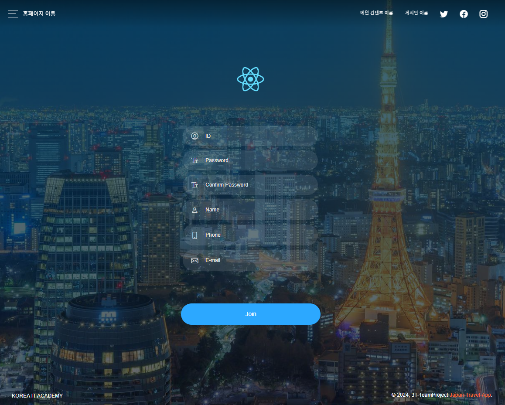 | 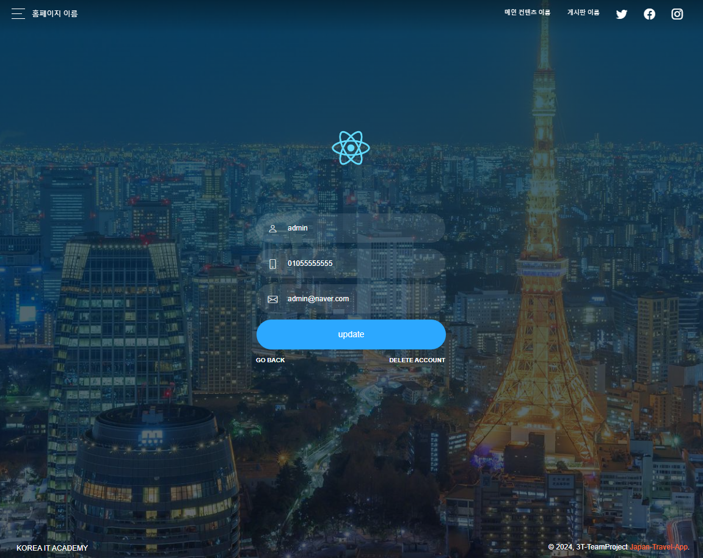 |
| 회원정보수정 페이지 | 숙소 추천 페이지     |
|  | 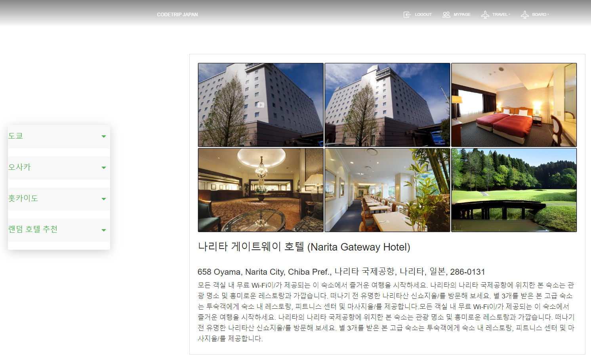 |
| 관광지 추천 페이지  | 공지사항             |
|  | 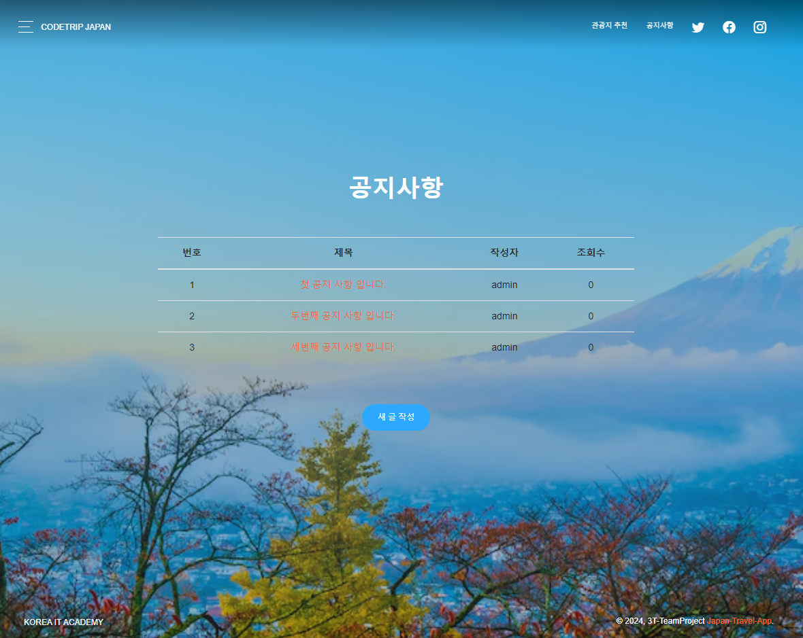 |
| 공지사항 - 새글작성 페이지 | 공지사항 - 본글 페이지 |
| 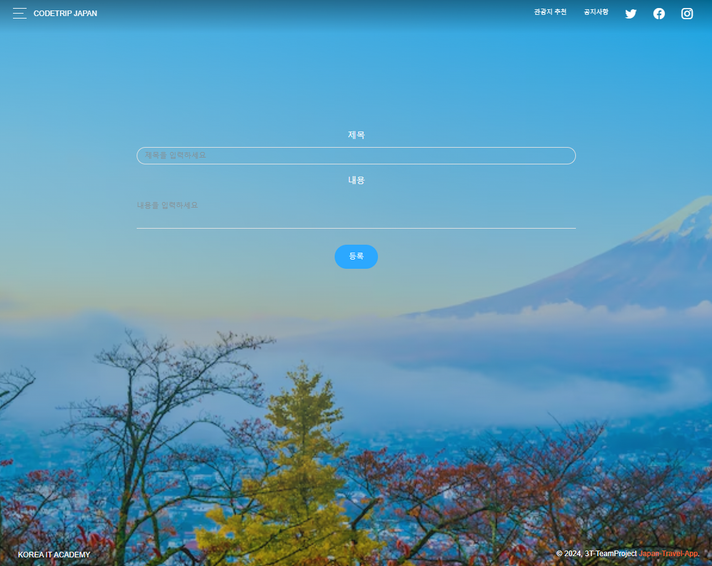 | 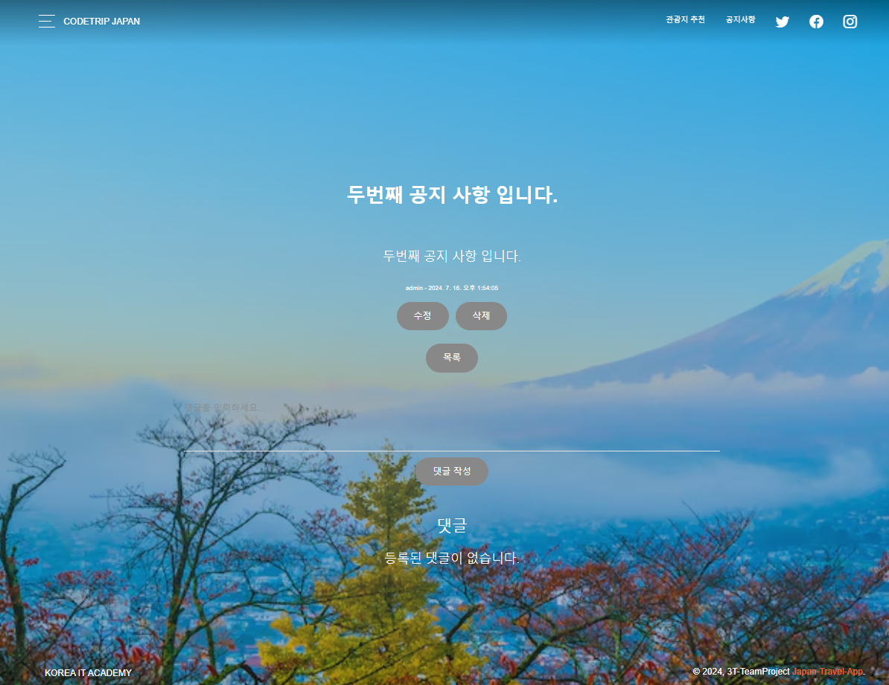 |
| 문의사항             | 문의사항 - 새글작성 페이지 |
| 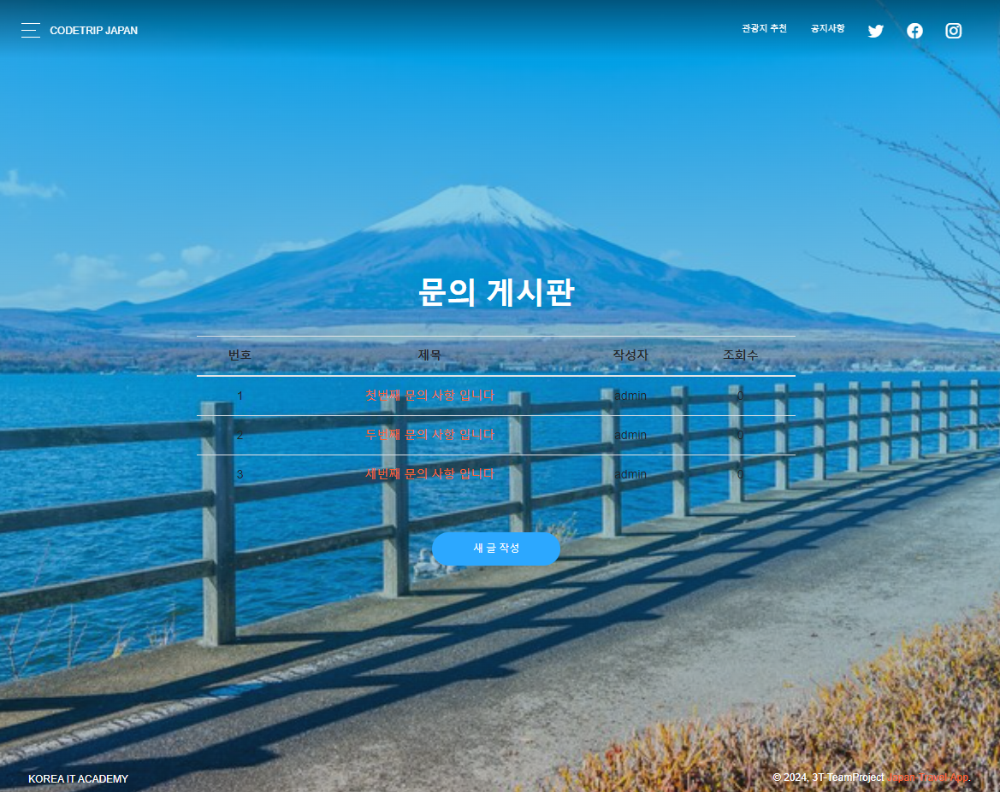 | 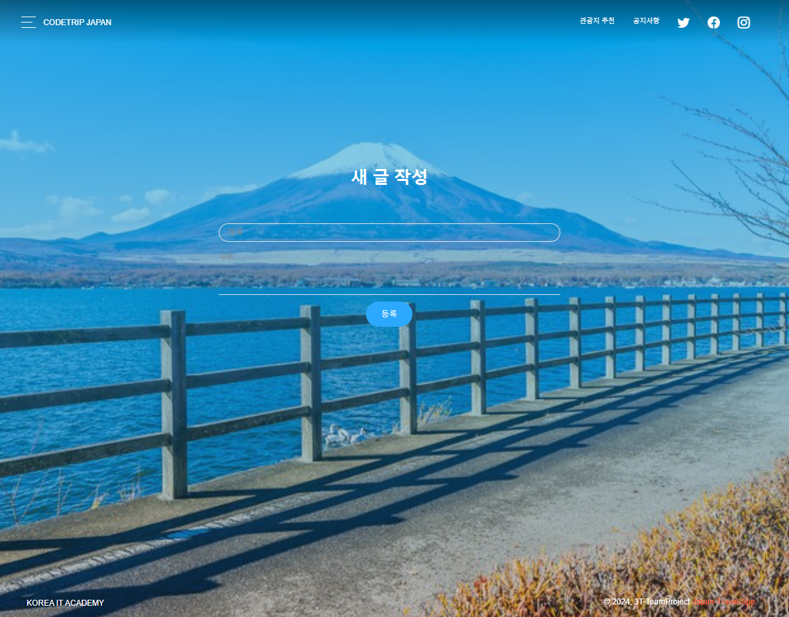 |
| 문의사항 - 본글 페이지 | -                  |
| 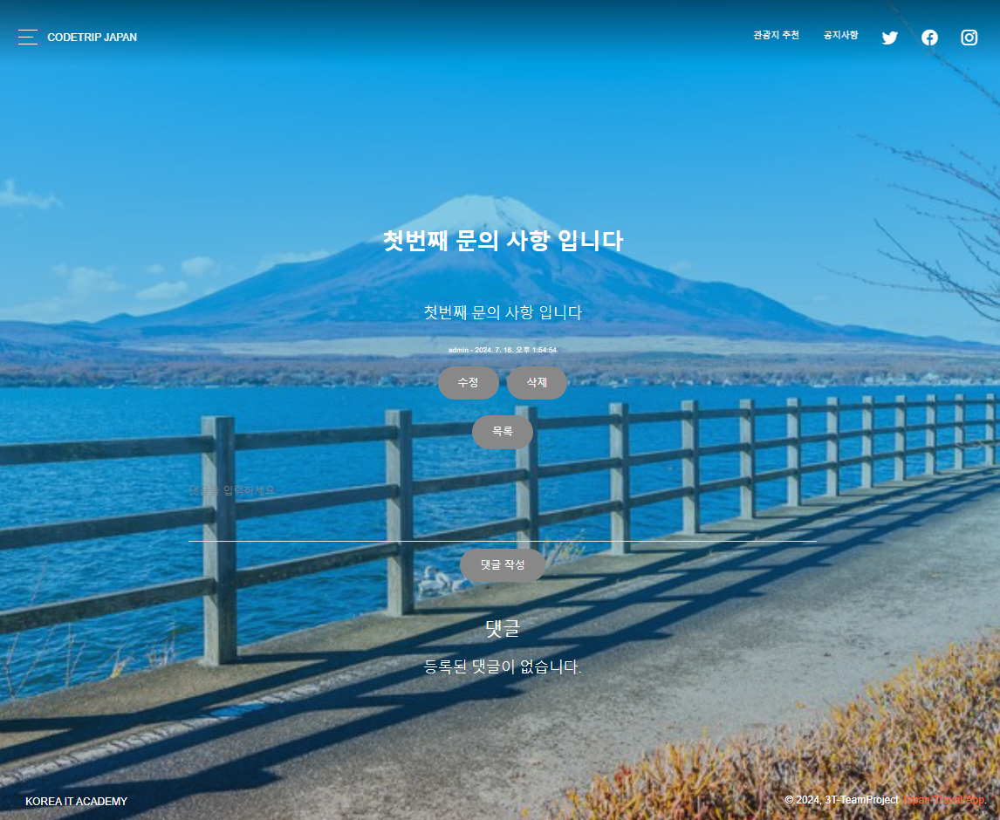 | -  
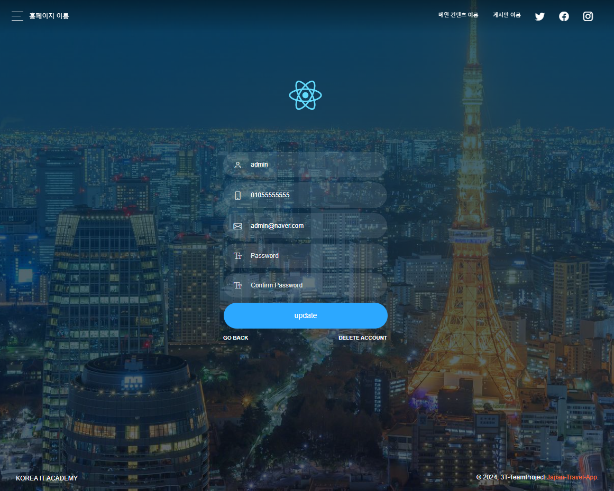

## 07. 아키텍쳐
### 디렉터리 구조
```
Folder PATH listing
Volume serial number is FC5A-1788
C:.
├───Final-3TP-Back
│   └───3tpback
│       ├───src
│       │   └───main
│       │       ├───java
│       │       │   └───com
│       │       │       └───_tpback
│       │       │           ├───config────────SecurityConfig.java (Spring Security의 설정을 정의)
│       │       │           │   └───auth──────UserDetailsServiceImpl.java (Spring Security의 UserDetailsService 인터페이스를 구현)
│       │       │           ├───controller
│       │       │           │   ├─────────────InquiryController.java
│       │       │           │   ├─────────────NoticeController.java
│       │       │           │   └─────────────UserController.java
│       │       │           ├───model
│       │       │           │   ├─────────────Comment.java
│       │       │           │   ├─────────────Inquiry.java
│       │       │           │   ├─────────────Notice.java
│       │       │           │   └─────────────UserDto.java (사용자 정보를 나타내는 데이터 전송 객체)
│       │       │           ├───repository
│       │       │           │   ├─────────────CommentRepository.java
│       │       │           │   ├─────────────InquiryRepository.java
│       │       │           │   ├─────────────NoticeRepository.java
│       │       │           │   └─────────────UserRepository.java
│       │       │           └───service
│       │       │               ├─────────────InquiryService.java
│       │       │               ├─────────────NoticeService.java
│       │       │               └─────────────UserService.java
│       │       └───resources
│       │           └─────────────application.properties
│       └───target
├───Final-3TP-Front
│   └───3tp-front
│       ├───node_modules
│       ├───public
│       │   └───img
│       └───src
│           ├───assets
│           │   ├───css
│           │   ├───demo
│           │   ├───fonts
│           │   ├───img
│           │   └───scss
│           ├───components
│           │   └───Footers
│           │       ├───────────────DarkFooter.js
│           │       └───────────────TransparentFooter.js
│           │   └───Headers
│           │       └───────────────IndexHeader.js
│           │   └───Navbars
│           │       ├───────────────ExamplesNavbar.js
│           │       └───────────────IndexNavbar.js
│           └───views
│               ├───Board
│               │   ├───────────────InquiryDetail.js
│               │   ├───────────────InquiryEditForm.js
│               │   ├───────────────InquiryForm.js
│               │   ├───────────────InquiryPage.js
│               │   ├───────────────NoticeDetail.js
│               │   ├───────────────NoticeEditForm.js
│               │   ├───────────────NoticeForm.js
│               │   └───────────────NoticePage.js
│               ├───index-sections
│               │   ├───────────────Main.js
│               │   ├───────────────Slide.js
│               │   └───────────────Tabs.js
│               ├───Login
│               │   ├───────────────JoinPage.js
│               │   ├───────────────LoginPage.js
│               │   ├───────────────UpdateUserPage.js
│               │   └───────────────UserInfoPage.js
│               └───Main-content
│                   ├───────────────DestinationPage.js
│                   └───────────────Hotels.js
├───old
├───readme-img
└───Readme.md

```