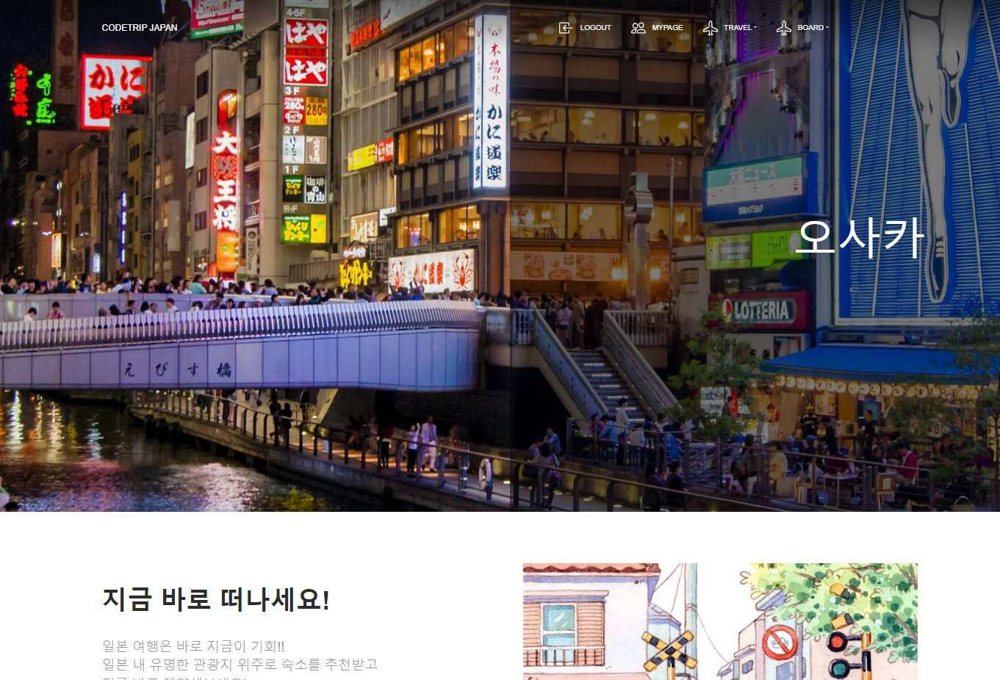

# 코리아 IT 아카데미 정처기 3Team Project
## 1. 프로젝트 제목 - CodeTrip Japan
 - 🚗 일본 관광 및 숙소 추천 사이트 만들기

## 2. 프로젝트 정보
- 코리아IT아카데미 정보처리기능사 팀 프로젝트

 - 애플리케이션 주요 기능
    1. Spring Security를 이용한 로그인, 로그아웃 및 회원가입, 회원정보수정, 회원탈퇴
    2. Validation 으로 유효성 검사 체크 (중복 등)
    3. 게시판 - 문의게시판과 공지게시판을 작성하고 열람 및 댓글 작성이 가능
    4. 게시판 작성시 로그인이 필요하며 작성자 이름은 유저 정보에서 가져와서 나타냄
    5. 작성자 계정이 아닌 다른 계정으로 로그인 할 경우 수정 및 삭제 불가능
    6. 
    7. 

이름         |       역할       |       깃허브주소
---         |        ---       |         ---
여정모       | Spring Security를 이용한 로그인 기능 구현     |https://github.com/PungFackMo
손명관       | -                |
이단비       |    -             |

## 3. 프로젝트 소개
- 사용 기능

